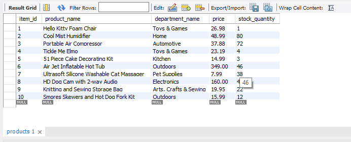
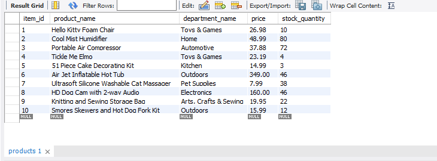
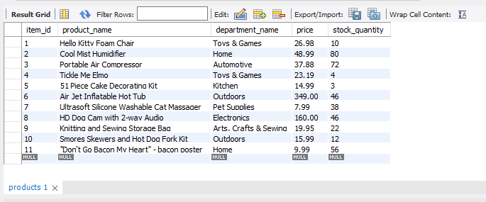

# Bamazon

MySQL and Node.JS are used to create a storefront CLI App.


## Getting Started

First clone this repository:

```
https://github.com/emmapankey/Bamazon.git
```


## Prerequisites

#### Node.js and npm
Go to the Node.js site: https://nodejs.org/en. Click the download button, and run through the installation file.
When you install node.js, npm is automatically installed.
To check if you have Node.js installed, run this command in your terminal:
```
node -v
```
To confirm that you have npm installed you can run this command in your terminal:
```
npm -v
```

#### Installing Node Packages


In the terminal execute the following command to install all node dependencies (see package.json for list):

```
npm install
```

## Run

To run the application and connect to the MySQL server execute the following commands in the respective .js files:

```
node bamazonCustomer.js
```
```
node bamazonManager.js
```

## Customer View

Product data for all currently in stock items are displayed for the customer. They are then prompted to place an order by providing the product id and desired number of units to purchase.


When a customer order is processed they are notified what their total purchase cost is and stock quantity is updated in the database.



If there is not enough product in stock to fulfill a customer order they are notified that the order cannot be completed.


## Manager View

Managers are prompted to choose from a set of menu options:
* View Products for Sale
* View Low Inventory
* Add to inventory
* Add New Product

###### View Products for Sale

If a manager selects `View Products for Sale` product data for all available items is listed.

###### View Low Inventory

If a manager selects `View Low Inventory` product data for items with an inventory count lower than five are listed.


###### Add to Inventory

If a manager selects `Add to Inventory` they are prompted to provide the product id and the number of units to add to a chosen item's inventory. The sql database is updated to reflect the change in inventory.




###### Add New Product

If a manager selects `Add New Product` they are prompted to provide the relevant sql table data for a brand new store item and the database is updated accordingly.




## Author

**Emma Pankey** (https://github.com/emmapankey)


## Technologies Used

* Javascript
* nodeJS
* MySQL
* npm packages:
	* mysql
    * inquirer
